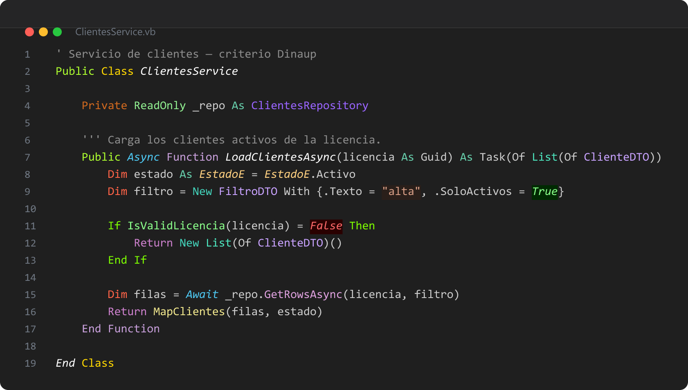
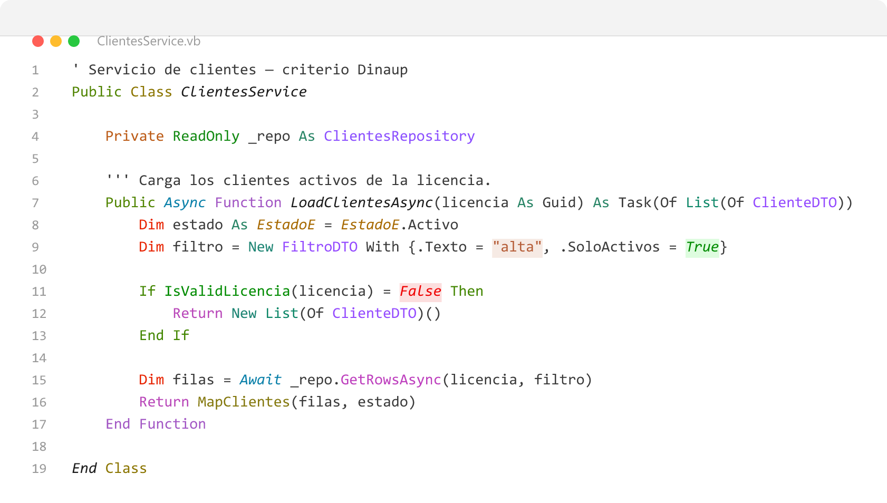

# Dinaup Highlight

**Colorea el código por lo que dice su nombre.** Donde el resaltado normal ve un identificador
y lo pinta de un solo color, esta extensión mira el nombre completo: `LoadClientesAsync` es una
carga, `ClientesService` es un servicio, `EstadoE` es un enum, `ClienteDTO` es un objeto de
transporte. Cada papel tiene su color, y ese color es el mismo en VB.NET, en C#, en Blazor y en
JavaScript.

Nació dentro de [Dinaup](https://dinaup.com) para leer de un vistazo bases de código grandes con
convenciones de nombre estrictas. Si tu equipo también nombra por convención —sufijos `Service`,
`Repository`, `DTO`, prefijos `Load`, `Save`, `Get`, `Is`— sirve igual, y los colores se cambian
uno a uno desde los ajustes.



En tema claro se usa la misma paleta oscurecida hasta ser legible sobre blanco, así que el
criterio se reconoce igual:



## Qué hace

**1 · Colorea por convención de nombres.** Prefijos, sufijos, palabras exactas y palabras clave
del lenguaje, con la misma tabla para todos los lenguajes soportados.

| Lenguaje | Palabras clave | Nombres | Etiquetas HTML |
|---|---|---|---|
| VB.NET (`.vb`) | sí | sí | — |
| C# (`.cs`) | sí | sí | — |
| JavaScript / TypeScript (y JSX/TSX) | sí | sí | — |
| Blazor / Razor (`.razor`, `.cshtml`) | dentro de `@code` y `@{ }` | sí | sí |
| Astro (`.astro`) | en el frontmatter y en `<script>` | sí | sí |
| HTML, Vue, Svelte, XML | — | sí | sí |

**2 · Marca el papel de cada archivo en el explorador.** El nombre se tiñe y se le añade una
insignia, según el sufijo:

| Sufijo | Archivos | Insignia | Papel |
|---|---|---|---|
| `Page` | `.razor` | P | Página con routing |
| `Subpage` | `.razor` | SP | Subpágina |
| `U` | `.razor` | U | Componente sin routing |
| `Dialog` | `.razor` | D | Diálogo |
| `Service` | `.cs` `.vb` | S | Servicio |
| `Controller` | `.cs` `.vb` | C | Controlador |
| `Repository` | `.cs` `.vb` | R | Repositorio |
| `DTO` | `.cs` `.vb` | DT | Objeto de transporte |
| `Manager` | `.cs` `.vb` | M | Manager |
| `Provider` | `.cs` `.vb` | PR | Provider |
| `Helper` | `.cs` `.vb` | H | Helper |
| `Middleware` | `.cs` `.vb` | MW | Middleware |
| `E` | `.cs` `.vb` | E | Enum |

El sufijo tiene que abrir segmento: `ClientesU` sí, `MENU` no.

**3 · Trae un tema de iconos.** Se activa aparte, en `Ctrl+Shift+P` → *Preferences: File Icon
Theme* → **Dinaup**. Cubre 89 extensiones y los nombres de archivo habituales; lo que no esté en
la lista sale con el icono genérico. En VS Code un tema de iconos es todo o nada: no se puede
cambiar sólo el de `.razor` y dejar el resto.

**4 · Indicador de entorno (sólo proyectos Dinaup).** Si algún `.csproj`/`.vbproj` del workspace
referencia un paquete `Dinaup*` o `DinaZen*`, aparece un indicador en la barra de estado con el
entorno activo. En cualquier otro proyecto no aparece y no se lee nada. Ver
[Privacidad](#privacidad).

## Requisitos

VS Code 1.75 o superior. Nada más: no necesita SDK, ni runtime, ni configuración previa.

Los colores están pensados para el editor de VS Code y se recalculan solos al cambiar entre tema
claro y oscuro. En temas de alto contraste se usa la paleta del tema claro u oscuro que
corresponda.

## Comandos

| Comando | Qué hace |
|---|---|
| `Dinaup: Activar o desactivar el coloreado` | Enciende y apaga el coloreado, sin tocar el tema de iconos |
| `Dinaup: Buscar todas las referencias` | Abre las referencias en el panel lateral. Sólo aparece en archivos que la extensión entiende |
| `Dinaup: Ver el entorno de Dinaup` | Lista las variables del entorno. Sólo aparece en proyectos que referencian paquetes de Dinaup |

## Ajustes

| Ajuste | Por defecto | Qué hace |
|---|---|---|
| `dinaupHighlight.enable` | `true` | Colorear con el criterio Dinaup |
| `dinaupHighlight.explorerMarks` | `true` | Marcar en el explorador los archivos que siguen la convención |
| `dinaupHighlight.maxFileSizeKB` | `1024` | Tamaño máximo de archivo que se colorea. Por encima, la extensión no interviene |
| `dinaupHighlight.colors` | `{}` | Sustituye el color de un formato concreto |
| `dinaupHighlight.environmentIndicator` | `true` | Muestra el indicador de entorno. Apagado, la extensión no abre ningún `.env` |
| `dinaupHighlight.environmentVariables` | `DinaupEnv`, `DinaupBranch`, `DinaupClientID`, `DinaupSecretID` | Variables que se muestran en el indicador |

### Formatos

Para cambiar un color suelto no hace falta recompilar nada:

```json
"dinaupHighlight.colors": {
  "serviceLayer": "#00FF88",
  "enumSuffix": "#FFAA00"
}
```

La clave es el nombre del formato. Los más usados son `serviceLayer`, `dataRepository`,
`dataTransferObject`, `managerClass`, `providerClass`, `utilityFunctions`, `middlewareLayer`,
`enumSuffix`, `creationFunction`, `validationFunction`, `stringLiteral` y `comment`. La lista
completa —97 formatos con su color, cursiva, tamaño y opacidad— está en
[`src/rules.json`](https://github.com/dinaupsoftware/dinaup-highlight/blob/main/src/rules.json),
que es la fuente única del criterio.

## Privacidad

La extensión **no envía nada a ningún sitio**: no hace peticiones de red, no recoge telemetría y
no escribe fuera de tus ajustes de VS Code.

El indicador de entorno lee archivos en local, y sólo bajo estas tres condiciones a la vez:

1. El ajuste `dinaupHighlight.environmentIndicator` está activado.
2. Confías en la carpeta abierta. En [Modo Restringido](https://code.visualstudio.com/docs/editor/workspace-trust)
   no se abre ningún archivo.
3. Algún proyecto del workspace referencia un paquete `Dinaup*` o `DinaZen*`.

Cumplidas las tres, lee el `.env` y el `.env.local` de la raíz de cada carpeta del workspace, y
las variables del entorno del sistema que estén en la lista. Los valores cuyo **nombre** contenga
`secret`, `password`, `passwd`, `pwd`, `token`, `key`, `credential`, `auth`, `connectionstring`,
`salt`, `cert`, `private` o `signature` se muestran como `****`, no se copian al portapapeles y
nunca aparecen en la barra de estado.

`dinaupHighlight.environmentVariables` tiene ámbito `machine`: un repositorio ajeno no puede
cambiar por su cuenta qué variables se leen.

## Limitaciones conocidas

- El tamaño de fuente por formato se inyecta como CSS en línea, porque VS Code no lo expone en las
  decoraciones. Si en alguna línea notas el cursor desplazado un píxel, es por eso: quita el `size`
  de ese formato y sube el contraste del color.
- El tema de iconos casa por extensión y por nombre exacto, nunca por patrón. Por eso el papel de
  `ClientesService.cs` se marca en el nombre y con una insignia, y no con un icono propio.
- El coloreado se aplica a todos los lenguajes de la tabla. Si sólo te interesa en algunos, hoy la
  única palanca es apagarlo entero con `dinaupHighlight.enable`.
- El lexer de C# no reconoce todavía los literales de cadena en bruto (`"""`) de C# 11.

## Soporte

Incidencias y sugerencias: [GitHub Issues](https://github.com/dinaupsoftware/dinaup-highlight/issues).

Historial de cambios: [CHANGELOG.md](CHANGELOG.md).

## Licencia

MIT — ver [LICENSE](LICENSE). © 2026 Dinaup Software, S.L.

Los iconos del tema proceden de [Devicon](https://github.com/devicons/devicon),
[vscode-icons](https://github.com/vscode-icons/vscode-icons) y
[Material Icon Theme](https://github.com/material-extensions/vscode-material-icon-theme), los tres
MIT. Los avisos completos están en [THIRD-PARTY-NOTICES.md](THIRD-PARTY-NOTICES.md).
